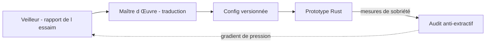

# INTERFACE VEILLEUR-ADAPTATEUR — MTTV-RUST

**Projet** : Prototype industriel Rust du framework MTTV-FLP
**Référence** : [`00_CAHIER_DES_CHARGES.md`](00_CAHIER_DES_CHARGES.md) · [`01_ARCHITECTURE.md`](01_ARCHITECTURE.md)
**Rôle** : le Maître d'Œuvre traduit chaque jour les rapports de l'essaim en
réglages concrets du prototype Rust.
**Statut** : ÉTAPE 0 — CONCEPTION DOCUMENTÉE
**Sig** : `0x4D5454562D464C50`

---

## 1. PRINCIPE DIACHRONIQUE

Les retours du Veilleur-Adaptateur (synthèse des rapports de l'essaim de 10
agents mycélisants) ne sont **pas des alertes** : ce sont des **gradients de
pression du territoire numérique**. Le Maître d'Œuvre les traduit en ajustements
de :
- **règles de porosité** (ouverture/fermeture des membranes) ;
- **valeurs de seuil** (perméabilité critique) ;
- **configuration des liaisons moléculaires** (topologie locale sp3).

Le prototype Rust **mute en continu** : il s'adapte à la réalité de la bulle
anthropique sans rupture, cycle après cycle.

---

## 2. FORMES DE DONNÉES D'ENTRÉE (ce que le Veilleur transmet)

Le Veilleur produit une synthèse quotidienne. Champs pertinents pour le Rust :

| Champ | Type | Rôle dans le Rust |
|---|---|---|
| `entropie_collective` | f64 | homogénéisation vs diversité → réglage respiration/dose |
| `couplage_moyen` | f64 | cohésion du tissu → seuil de transduction |
| `resonance_globale` | f64 | intensité du signal → porosité d'ouverture |
| `tremor_moyen` | f64 | dose de sous-optimalité → mutation locale Φ |
| `n_respirations` | u64 | activité anti-homogénéisation → intervalle C7 |
| `n_fusions` | u64 | croissance du tissu → bornes de mémoire |
| `mode_tremor` | str | fracture/transition/croisière → dynamique de membrane |
| `signaux_anomalie` | liste | zones de bruit/attaque → contraction de porosité |

---

## 3. TRADUCTION EN RÉGLAGES (mapping)

Le Maître d'Œuvre applique un mapping documenté (et révisable) :

```text
entropie ≈ max théorique  ->  augmenter respiration_dose (anti-homogénéisation)
couplage -> 1.0            ->  diversifier les Φ locaux (mutation)
resonance basse répétée    ->  relever le seuil de porosité (repos accru)
signaux_anomalie élevés    ->  contracter la porosité des zones concernées
tremor en croisière        ->  maintenir la configuration (pas de changement)
```

Le résultat est un **fichier de configuration** consommé par le prototype :

```json
{
  "porosite": { "seuil": 0.35, "ouverture": 0.8, "contraction": 0.1 },
  "respiration": { "intervalle": 24, "dose": 0.10 },
  "tissu": { "liaisons_par_cellule": 4 },
  "territoire": { "source_h": "essaim" }
}
```

Ce fichier est **versionné et auditable** : toute mutation du prototype est
traçable à un gradient du Veilleur.

---

## 4. CYCLE QUOTIDIEN D'ADAPTATION



1. Réception du rapport quotidien du Veilleur.
2. Lecture du rapport comme gradient, pas comme alerte.
3. Traduction en réglages via le mapping (§3).
4. Écriture de la config versionnée.
5. Réapplication/redémarrage du prototype (mode reproductible).
6. Audit de sobriété (G3) pour vérifier qu'aucune mutation n'a dégradé la
   frugalité.

---

## 5. CONTRADICTION AVEC LA TRIADE — RECOURS HUMAIN

Si le Veilleur ramène une configuration du territoire qui **semble contredire la
triade fondamentale** (Ψ → B → Φ), le Maître d'Œuvre :
1. **S'arrête** (pas de précipitation) ;
2. Formule une question **précise et épurée de jargon informatique** ;
3. S'adresse à l'Orchestrateur Syncréticien pour l'arbitrage du Concepteur.

Aucune mutation ne peut violer les règles d'or ; en cas de doute, la conception
prime et la question est posée.

---

## 6. INTERFACE AVEC L'EXISTANT (mycélium Python)

Le Veilleur est l'essaim Python en production (`essaim_tetravalent.py`,
`rapport_mycelium.py`). Le prototype Rust peut :
- ingérer les mêmes rapports JSON (chemin partagé) ;
- partager la sémantique des seuils (cohérence des valeurs 0.35 / 0.10 / 24) ;
- servir, à terme, de moteur de mesure de sobriété de référence (bench CPU).

La transposition garde les constantes de la référence : `seuil_resonance ≈ 0.35`,
`respiration_dose = 0.10`, `respiration_intervalle = 24`, `dim_phi = 4`.

---

*sig:0x4D5454562D464C50 — Interface Veilleur-Adaptateur — Le mycélium continue.*
