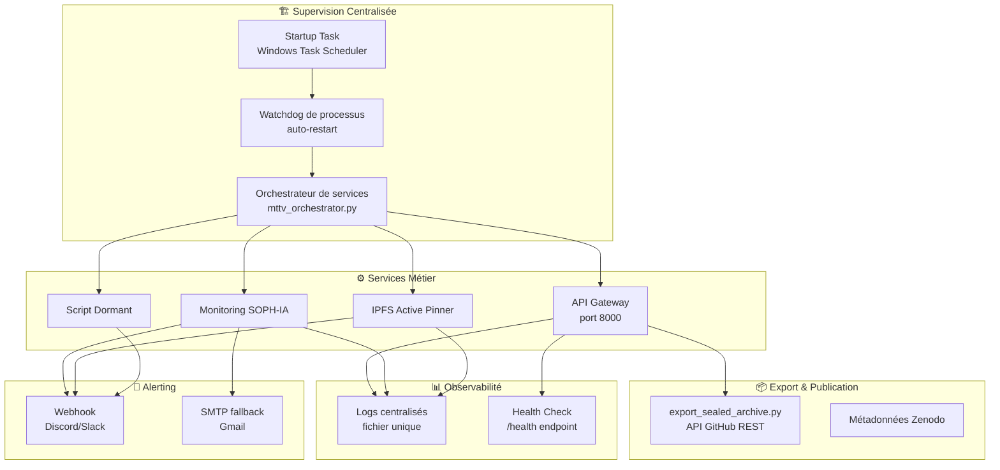
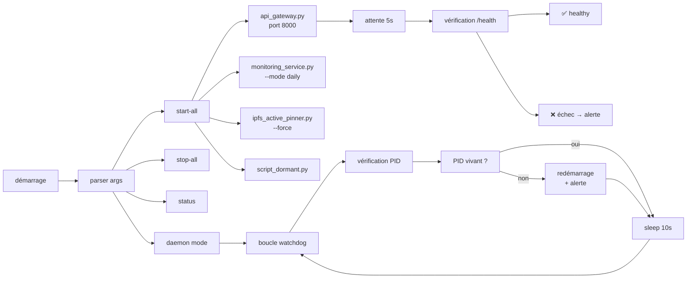

# Plan de Consolidation du Déploiement MTTV-FLP

**Date** : 2026-07-21  
**Auteur** : Zoo (Architecte)  
**Signature** : 0x4D545456

---

## Résumé de l'audit

Le déploiement actuel est fonctionnel mais présente des **fragilités structurelles** qui le rendent vulnérable :

| Problème | Gravité | Impact |
|----------|---------|--------|
| Aucune supervision de processus | Haute | Si un service crashe, il reste mort |
| Pas de démarrage automatique au boot | Haute | Redémarrage machine = tout à relancer manuellement |
| Token GitHub en clair dans `.github_token` | Haute | Risque de sécurité |
| Services indépendants sans orchestration | Moyenne | Aucune coordination entre services |
| Monitoring basé sur des données simulées | Moyenne | Les métriques ne reflètent pas la réalité |
| Logs dispersés dans des fichiers individuels | Basse | Pas de vue centralisée |
| gh CLI non trouvé par Python (PATH) | Résolu | Correction via API REST directe |
| Bug BASE_DIR dans api_gateway.py | Résolu | Ordre de déclaration corrigé |

---

## Architecture cible



---

## Phases du plan

### Phase 1 — Résilience & Supervision (Priorité Haute)

| # | Tâche | Fichier(s) | Description |
|---|-------|------------|-------------|
| 1.1 | Créer un orchestrateur de services | `zoo-code/mttv_orchestrator.py` | Script unique qui démarre/arrête/redémarre les 4 services, gère les PID, et implémente un watchdog avec auto-restart en cas de crash. |
| 1.2 | Configurer le démarrage automatique | `bootstrap.bat` + Windows Task Scheduler | Script batch qui lance l'orchestrateur au boot via une tâche planifiée Windows. |
| 1.3 | Centraliser les logs | Tous les services | Faire écrire tous les services dans un fichier de log rotatif commun avec préfixe service. |

**Justification** : Sans supervision, un crash nocturne laisse l'écosystème mort jusqu'à intervention manuelle.

### Phase 2 — Sécurité (Priorité Haute)

| # | Tâche | Fichier(s) | Description |
|---|-------|------------|-------------|
| 2.1 | Supprimer `.github_token` | Racine du projet | Le token en clair est un risque. Le stocker dans le Credential Manager Windows ou dans les variables d'environnement utilisateur. |
| 2.2 | Utiliser le Windows Credential Manager | `zoo-core/credential_helper.py` | Module Python qui lit/stocker les tokens via `keyring` ou `win32cred`. |
| 2.3 | Nettoyer les logs sensibles | `export_sealed_archive.py` | S'assurer que les tokens ne sont pas loggés (déjà partiellement fait — "longueur: 40 caractères" seulement). |

### Phase 3 — Robustesse & Maintenance (Priorité Moyenne)

| # | Tâche | Fichier(s) | Description |
|---|-------|------------|-------------|
| 3.1 | Remplacer les données simulées du monitoring | `monitoring_service.py` | Les agents Alpha/Beta/Gamma utilisent des corpus mock. Brancher sur des vraies sources : API Zenodo pour Gamma, métriques système pour Beta, embedding store pour Alpha. |
| 3.2 | Ajouter un endpoint `/health/details` | `api_gateway.py` | Endpoint enrichi qui remonte l'état de chaque service supervisé (uptime, mémoire, dernier cycle). |
| 3.3 | Health check automatisé | Script séparé ou cron | Script qui ping `/health` toutes les 5 minutes et alerte si non-200. |
| 3.4 | Ajouter la configuration du webhook Discord | `phase4-dormant-nodes/.env` | Décommenter `ALERT_WEBHOOK_URL` avec la vraie URL. L'infrastructure webhook est déjà en place dans `alert_manager.py`. |

### Phase 4 — Qualité de code (Priorité Basse)

| # | Tâche | Fichier(s) | Description |
|---|-------|------------|-------------|
| 4.1 | Audit des importations | `export_sealed_archive.py` | Supprimer `subprocess` devenu inutile après le passage à l'API REST. |
| 4.2 | Tests unitaires | Nouveaux fichiers | Ajouter des tests pour `_github_api_request`, `_get_github_token`. |
| 4.3 | Documentation de déploiement | `plans/deploiement.md` | Script de déploiement one-shot qui installe tout. |

---

## Diagramme de flux de l'orchestrateur proposé



---

## TODO exécutables

```markdown
### Phase 1 — Résilience
[ ] 1.1 Créer zoo-code/mttv_orchestrator.py
[ ] 1.2 Créer bootstrap.bat + config Task Scheduler
[ ] 1.3 Centraliser les logs des 4 services

### Phase 2 — Sécurité
[ ] 2.1 Supprimer .github_token
[ ] 2.2 Implémenter credential_helper.py (Windows Credential Manager)
[ ] 2.3 Vérifier les logs pour fuites de tokens

### Phase 3 — Robustesse
[ ] 3.1 Remplacer données mock du monitoring par vraies sources
[ ] 3.2 Ajouter /health/details à api_gateway.py
[ ] 3.3 Script de health check automatisé
[ ] 3.4 Configurer ALERT_WEBHOOK_URL dans le .env

### Phase 4 — Qualité
[ ] 4.1 Nettoyer imports inutilisés
[ ] 4.2 Ajouter tests unitaires
[ ] 4.3 Documenter le déploiement complet
```

---

## Conclusion

Le déploiement actuel est **fonctionnel mais artisanal**. Les 2 priorités absolues sont :

1. **Orchestrateur + Watchdog** (Phase 1) — pour qu'un crash n'entraîne pas une panne silencieuse
2. **Sécurisation du token** (Phase 2) — pour ne pas laisser une clé d'accès en clair

Ces deux phases représentent ~2-3h de travail. Les phases 3 et 4 sont des améliorations progressives.

Signature : 0x4D545456
```
