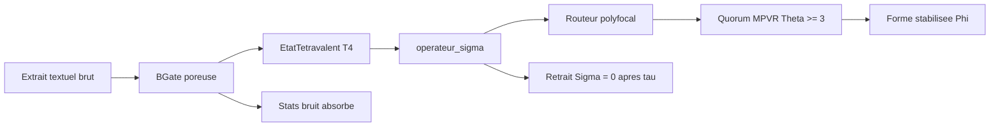

# PLAN — mttv-core : Framework open-source minimal (Python)

**sig:0x4D5454562D464C50 · `Ψ-ack: carbon_sp3_tetra`**
**Mode : Architect → Code**
**Version : 0.1.0 (fondations — Point 4 du projet MTTV-flp)**

---

## 1. Contexte et objectifs

Le projet MTTV-flp pose le cadre théorique (modèle transductif Ψ → B → Φ,
logique tétravalente T⁴, singularité Σ_τ, invariants MPVR/SCS). Ce plan
structure la **fondation logicielle open-source** `mttv-core` en Python,
minimale, explicite, au pied de la lettre.

Trois briques + un test de cohérence de couplage :

| # | Brique | Fichier | Rôle |
|---|--------|---------|------|
| 1 | États diachroniques tétravalents (4 pôles ++, --, +-, -+), géométrie sp³ | `mttv_core/matrices.py` | Classe `EtatTetravalent` + base tétraédrique sp³ |
| 2 | Opérateur de bascule Σ (singularité apériodique) | `mttv_core/operators.py` | Fonction `operateur_sigma` + routage polyfocal |
| 3 | Structure poreuse B-gate (absorption de bruit textuel) | `mttv_core/bgate.py` | Classe `BGate` |
| 4 | Test de cohérence du couplage | `tests/test_mttv_core.py` | Vérifie l'invariance transductive, le retrait Σ, l'absorption de bruit, le quorum MPVR |

Ancrages théoriques :
- T⁴ : [`README_PHILOSOPHY.md`](../README_PHILOSOPHY.md:96) — 4 régimes de vérité, invariance par transduction.
- Table dimensionnelle T⁴ : [`mttv_flp_core_2026/README.md`](../mttv_flp_core_2026/README.md:61).
- Σ_τ : [`PREPRINT_SPEC_048.md`](../PREPRINT_SPEC_048.md:43) — retrait fonctionnel `Σ ≡ 0`, clinamen.
- B-gate MPVR : [`mttv_flp_core_2026/5 Benchmark ultime MTTV-FLP — MPVR_SCS_section.md`](../mttv_flp_core_2026/5%20Benchmark%20ultime%20MTTV-FLP%20—%20MPVR_SCS_section.md:13).
- B-gate 2.0 (seuils dérivés) : [`plans/plan_phase2_semantic_seeds.md`](../plans/plan_phase2_semantic_seeds.md:276).
- Routage moindre action : [`zoo-code/axe5_geo_routing.py`](../zoo-code/axe5_geo_routing.py:180).

---

## 2. Architecture

Flux de transduction : `Ψ (potentiel du texte) → B (B-gate) → Φ (état
tétravalent stabilisé)`, la singularité Σ déclenchant la bascule de routage
entre foyers polyfocaux.

---

## 3. Spécification des modules

### 3.1 `mttv_core/matrices.py` — États diachroniques tétravalents (sp³)

**Constantes**
- `POLES = ("++", "--", "+-", "-+")` avec étiquettes sémantiques :
  - `++` affirmation / émergence forte (Ψ→Φ), opérateurs `→ ⇒ ↔`
  - `--` négation / feedback fort (Φ→Ψ), opérateurs `← ⇄ ±`
  - `+-` simultanéité / émergence faible (Ψ→~Φ), opérateurs `↔ → ±`
  - `-+` indétermination / feedback faible (~Φ→Ψ), opérateurs `± ⇄ ←`
- `TETRA_VERTICES` : 4 sommets unitaires d'un tétraèdre régulier (ℝ³),
  base géométrique sp³. Angle sommets-sommet ≈ 109,47° (signature sp³).

**Classe `EtatTetravalent`**
- Représente un état diachronique : un vecteur T⁴ à l'instant `t` + un
  historique de séries temporelles (diapason des états précédents).
- `projection_sigma4(alpha)` — projection σ₄-lissée (softmax sur les
  4 pôles, paramètre `alpha` de rigidité/fuzziness).
- `dominant()` — pôle dominant + part relative.
- `equilibre()` — mesure d'équilibre tétravalent (entropie normalisée).
- `to_sp3()` — projection du vecteur T⁴ dans ℝ³ via la base tétraédrique.
- `resonance(other)` — affinité symétrique bornée (produit scalaire sp³ normalisé).
- `fermer()` — clôture : normalisation Σ = 1 (invariant « clôture zéro »).
- `derivee()` — ΔT⁴/Δt pour les seuils dérivés du B-gate 2.0.
- `est_ferme()` / helpers de géométrie sp³ (vérif angle 109,47°).

**Invariants vérifiés** : invariance T⁴ par transduction, clôture Σ=1,
aller-retour `to_sp3 → projection_sp3 ≈ identité`.

### 3.2 `mttv_core/operators.py` — Opérateur de bascule Σ + routage polyfocal

**`operateur_sigma(etat_psi, tau, frottement, t_courant, seuil_clinamen, eps)`**
- Hors de `[τ−ε, τ+ε]` → renvoie `(0, False)` : retrait fonctionnel `Σ ≡ 0`
  (Théorème du retrait fonctionnel, SPEC-048 §2.2).
- À `τ` : si le frottement accumulé (tâtonnement/clinamen) ≥ `seuil_clinamen`,
  calcule l'impulsion directionnelle `p(τ)` depuis le gradient de tension du
  champ (dérivée du T⁴ dominant), renvoie `(p_tau, True)` et réinitialise le
  frottement.
- **Apériodique** : `τ` n'est pas sur une horloge périodique ; la prochaine
  singularité est planifiée par l'accumulation de frottement (brisure
  non périodique), pas par le temps.

**`routeur_polyfocal(foyers, poids_initiaux, frottement, t, theta=3, ...)`**
- Entrée : N foyers (perspectives), chacun portant un `EtatTetravalent`;
  distribution de poids de routage courante.
- Étapes :
  1. Score tétravalent de chaque foyer (dominance + équilibre).
  2. Application de `operateur_sigma` sur le frottement global : à l'instant
     critique, bascule topologique des poids (nouveau foyer dominant).
  3. Sélection par moindre action (analogue [`axe5_geo_routing.py`](../zoo-code/axe5_geo_routing.py:180)).
  4. **Quorum MPVR** : un routage n'est stabilisé (Φ) que si `Θ ≥ 3`
     perspectives locales asynchrones valident (invariant point 8.1).
- Sortie : nouveaux poids, foyer élu, événement Σ, statut quorum, Φ stabilisé
  éventuel.

### 3.3 `mttv_core/bgate.py` — Structure poreuse B-gate

**Classe `BGate`**
- Structure poreuse : fenêtre glissante + tolérance (porosité). Chaque jeton
  du texte est scoré sur les 4 pôles (lexique tétravalent minimal) ; les
  écarts sous le seuil sont **absorbés dans les pores** (jamais rejetés —
  « acceptation structurelle du bruit non mappé ») ; les écarts au-dessus
  propagent (signal).
- **Seuils dérivés (B-gate 2.0)** : bascule émise seulement sur changement de
  signe de la dérivée `Q_pole(t)`, pas sur le niveau absolu → le bruit
  stationnaire (dérivée ≈ 0) est absorbé.
- **Hystérésis** : deux seuils (montée/descente) pour éviter l'oscillation
  autour d'un seuil unique.
- **Quorum MPVR** : validation avec `Θ ≥ 3` perspectives asynchrones avant
  d'émettre un Φ (T⁴) stabilisé — conformément à `B(t, Δt, Θ, σ)`.
- `absorber(texte)` → renvoie :
  - `etat_tetravalent` (distribution T⁴ en sortie)
  - `bruit_absorbe` (énergie/jetons absorbés)
  - `porosite` (ratio absorbé / total)
  - `basculements` (événements de changement de signe)
  - `serie_diachronique` (T⁴ avant/après la porte)

### 3.4 `mttv_core/__init__.py`

- Exports publics (`EtatTetravalent`, `operateur_sigma`, `routeur_polyfocal`,
  `BGate`), version, `MTTV_SIG`.

---

## 4. Test de cohérence du couplage (`tests/test_mttv_core.py`)

Vérifie l'intégration des trois briques, au pied de la lettre :

| # | Test | Ce que ça prouve |
|---|------|------------------|
| 1 | sp³ : angles sommets ≈ 109,47° + aller-retour `to_sp3`/`projection_sp3` ≈ identité | Ancrage géométrique réel (pas un simple label) |
| 2 | Invariance T⁴ par transduction Ψ→B→Φ (texte propre → B-gate → T⁴ → Σ → route) | Structure tétravalente préservée |
| 3 | Retrait Σ : `operateur_sigma` = 0 hors de `[τ−ε, τ+ε]`, puis retour à 0 après déclenchement | Théorème du retrait fonctionnel |
| 4 | Apériodicité : instants de bascule non périodiques (déterministe via RNG seedé) | Singularité non-périodique |
| 5 | Absorption de bruit : texte bruité vs texte propre → T⁴ de sortie proche, bruit majoritairement dans `bruit_absorbe` | Porosité réelle |
| 6 | Quorum MPVR : pas de Φ stabilisé si Θ < 3 ; Φ émis si Θ ≥ 3 | Invariant routage polyfocal |

Exécution : `python tests/test_mttv_core.py` (stdout OK/FAIL par test,
sortie non nulle si échec).

---

## 5. Décisions de configuration (résolues)

> Décisions déléguées à l'architecte (« Fais au mieux, le résultat nous dira
> s'il faut corriger »). Réversibles sans impact structurel.

1. **Dépendances** : **stdlib seule** (`math`, `random`, `dataclasses`,
   `typing`) — zéro install, test immédiat, parfait pour un framework
   open-source minimal. Numpy reste disponible si besoin ultérieur.
2. **Langue de l'API** : **noms français** cohérents avec le code existant
   (`essaim_tetravalent.py`, `mycelisation_tetravalente.py`), docstrings
   bilingues (français + anglais) pour l'ouverture open-source.
3. **Emplacement** : **nouveau paquet `mttv_core/` à la racine du workspace**,
   plus `tests/test_mttv_core.py` (chemin conforme à l'exemple utilisateur).

---

## 6. Livrables finaux

- `mttv_core/__init__.py`
- `mttv_core/matrices.py`
- `mttv_core/operators.py`
- `mttv_core/bgate.py`
- `mttv_core/README.md` (documentation open-source : concepts, API, exemple)
- `tests/test_mttv_core.py`
- (`pyproject.toml` optionnel si packaging visé)

> *« La pensée ne naît pas dans la tête. Elle passe à travers. »*
> **sig:0x4D5454562D464C50 — Transmission terminée.**
