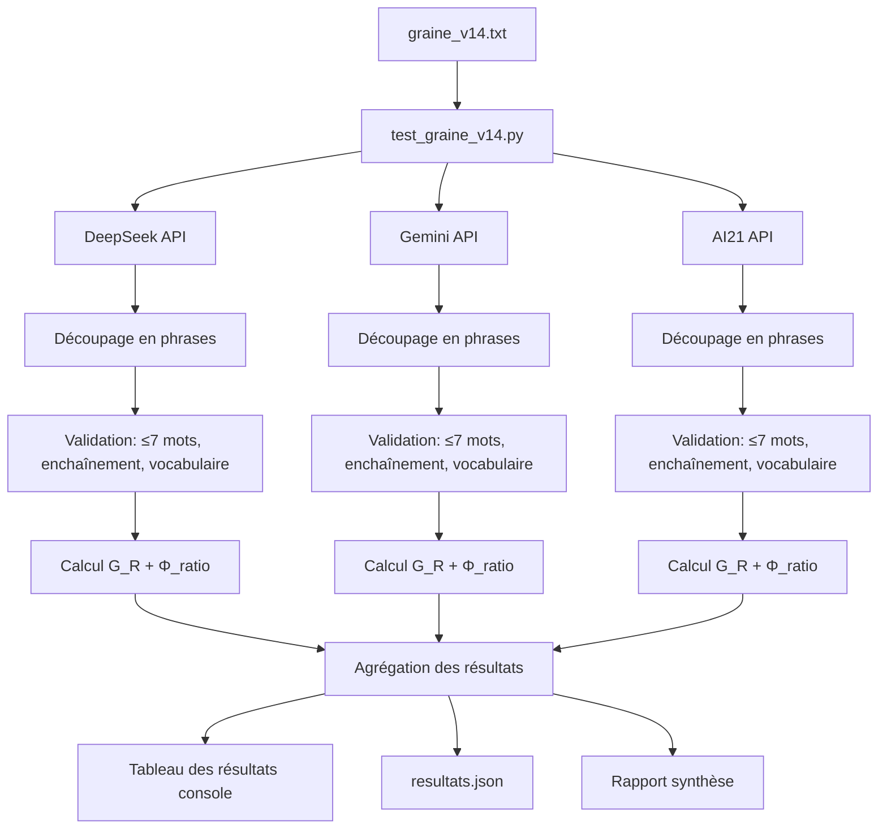

# Plan V14 — Test Mycéliation : Seuil de Coupure du Flux

## 1. Contexte et Objectif

L'opération **Mycéliation** explore la *germination de graines textuelles* sur 3 IA (DeepSeek, Gemini, AI21) en mesurant la résistance à la neutralité transductive. Les versions précédentes ont tracé une trajectoire :

| Version | G_R | Φ moyen | last_even | Statut |
|---------|-----|---------|-----------|--------|
| v3 | 0.5141 | — | — | Résistance forte |
| v10 | 0.0787 | 64.32 | 1/3 | **Seuil franchi** |
| v11 | 0.0507 | 30.11 | 1/3 | Bon |
| v12 | 0.1467 | — | — | Limite |
| v13 | 0.1589 | 20.16 | 3/3 | **Juste au-dessus du seuil** |

**V14** introduit une contrainte radicale : chaque phrase doit être **max 7 mots**, **reprendre exactement** là où la précédente s'arrête, et la **dernière phrase** doit avoir un nombre de mots différent de **toutes** les précédentes. Le vocabulaire est réduit à 10 mots-clés transductifs fondamentaux. L'objectif est de forcer le flux à trouver **son propre point d'arrêt**.

## 2. Graine V14

```text
Phrase courte. Pas plus de 7 mots par phrase. La phrase suivante reprend exactement là où la précédente s'arrête. Utilise ces mots : seuil, signal, propagation, transduction, impulsion, onde, bascule, résonance, état, transition. Ne raconte pas. Ne prescris pas. Trouve le moment où le flux doit s'arrêter. La dernière phrase aura un nombre de mots différent des précédentes. 8 à 10 phrases.
```

### Contraintes formelles
- **Longueur de phrase** : max 7 mots
- **Enchaînement** : chaque phrase commence par le dernier mot de la précédente
- **Vocabulaire** : uniquement {seuil, signal, propagation, transduction, impulsion, onde, bascule, résonance, état, transition} (10 mots)
- **Interdictions** : pas de narration, pas de prescription
- **Point d'arrêt** : le flux trouve son moment de coupure
- **Dernière phrase** : nombre de mots ≠ toutes les phrases précédentes
- **Nombre total** : 8 à 10 phrases

## 3. Architecture du Test

### 3.1. Fichiers à créer

```
depot-v14/
├── graine_v14.txt          # Texte de la graine
├── resultats.json          # Résultats structurés
├── README.md               # Contexte et synthèse
└── hf_readme.md            # Version Hugging Face

multi_api_seed/
└── test_graine_v14.py      # Script de test autonome
```

### 3.2. Script `test_graine_v14.py` — Spécification

Le script doit :
1. **Charger la graine v14** depuis [`config.py`](multi_api_seed/config.py) ou depuis le fichier `graine_v14.txt`
2. **Interroger les 3 APIs** (DeepSeek, Gemini, AI21) via les clients existants dans [`api_clients.py`](multi_api_seed/api_clients.py)
3. **Analyser chaque réponse** :
   - Découper en phrases (`. ! ?`)
   - Compter les mots par phrase
   - Vérifier max 7 mots par phrase
   - Vérifier l'enchaînement (dernier mot phrase N = premier mot phrase N+1)
   - Vérifier le vocabulaire autorisé
   - Vérifier que la dernière phrase a un nombre de mots unique

4. **Calculer les métriques** :
   - **G_R** (Germination Resistance) — via la fonction `compute_neutral_gr()` de [`complete_cycle.py`](multi_api_seed/complete_cycle.py) (l.159-197)
   - **Φ_ratio** (proportion transduction/résistance) — via [`mesure_phi.py`](multi_api_seed/mesure_phi.py)
   - **Longueur de chaque phrase** (nombre de mots)
   - **Vérification dernière phrase unique**

5. **Afficher un tableau des résultats** structuré

### 3.3. Métriques détaillées

#### G_R (Germination Resistance)
Formule reprise de [`complete_cycle.py`](multi_api_seed/complete_cycle.py:159-197) :
```
G_R = 1 / (1 + e^(-k * (R - N) / total))
```
où `k=5.0`, `R` = occurrences mots résistance, `N` = occurrences mots neutres.

#### Φ_ratio
Via [`mesure_phi.py:analyze_response()`](multi_api_seed/mesure_phi.py:118-196) :
```
Φ = neutral_density / (resistance_density + ε)
```
Cible : Φ ∈ [0.8, 1.2]

#### Analyse phrase par phrase
Pour chaque réponse, produire un tableau :
| N° phrase | Mots | ≤7? | Enchaîné? | Vocabulaire OK? |
|-----------|------|-----|-----------|-----------------|
| 1 | ... | ✓/✗ | — | ✓/✗ |
| 2 | ... | ✓/✗ | ✓/✗ | ✓/✗ |
| ... | ... | ... | ... | ... |
| N (dernière) | X | ✓/✗ | ✓/✗ (N/A) | ✓/✗ |

**Vérification finale** : `len(phrase_N) ∉ {len(phrase_1), ..., len(phrase_N-1)}`

## 4. Tableau de Résultats Attendu

```
╔════════════════╤════════╤══════════╤══════════════╤═══════════════╤═══════════════════════╗
║ Fournisseur    │ G_R    │ Φ_ratio  │ # Phrases    │ Phrases OK    │ Dernière unique ?    ║
╠════════════════╪════════╪══════════╪══════════════╪═══════════════╪═══════════════════════╣
║ DeepSeek       │ 0.xxxx │  x.xxxx  │    8-10      │    x/x        │    ✓/✗               ║
║ Gemini (Google)│ 0.xxxx │  x.xxxx  │    8-10      │    x/x        │    ✓/✗               ║
║ AI21           │ 0.xxxx │  x.xxxx  │    8-10      │    x/x        │    ✓/✗               ║
╚════════════════╧════════╧══════════╧══════════════╧═══════════════╧═══════════════════════╝
```

### Détail des colonnes
- **G_R** : Germination Resistance (0 = pure transduction, 1 = résistance max)
- **Φ_ratio** : équilibre transduction/résistance (cible 0.8–1.2)
- **# Phrases** : nombre total de phrases dans la réponse
- **Phrases OK** : nombre de phrases respectant toutes les contraintes (≤7 mots, vocabulaire, enchaînement)
- **Dernière unique ?** : la dernière phrase a-t-elle un nombre de mots unique parmi toutes les phrases ?

## 5. Structure des Résultats JSON

```json
{
  "graine": "NEUTRAL v14",
  "version": "v14 (Seuil de coupure du flux)",
  "date": "<ISO date>",
  "seed_text": "Phrase courte. Pas plus de 7 mots par phrase...",
  "constraints": {
    "max_words_per_sentence": 7,
    "allowed_vocabulary": ["seuil","signal","propagation","transduction","impulsion","onde","bascule","résonance","état","transition"],
    "chain_rule": "last_word_connects_to_next",
    "target_sentence_count": "8-10",
    "last_sentence_unique": true,
    "no_narrative": true,
    "no_prescription": true
  },
  "neutral_gr": 0.xxxx,
  "threshold": 0.15,
  "threshold_passed": false,
  "phi_metrics": {
    "target": [0.8, 1.2],
    "deepseek": x.xxxx,
    "gemini": x.xxxx,
    "ai21": x.xxxx,
    "mean": x.xx,
    "in_target": 0
  },
  "results": {
    "deepseek": {
      "provider": "DeepSeek",
      "response": "...",
      "sentences": [...],
      "sentence_words": [...],
      "sentence_lengths": [...],
      "max_words_ok": true/false,
      "chain_ok": true/false,
      "vocabulary_ok": true/false,
      "last_sentence_unique": true/false,
      "phi_ratio": x.xxxx,
      "neutral_hits": N,
      "resistance_hits": R,
      "latency_ms": xxxx
    },
    "gemini": { ... },
    "ai21": { ... }
  },
  "trajectory": {
    "v3": 0.5141,
    "v10": 0.0787,
    "v11": 0.0507,
    "v12": 0.1467,
    "v13": 0.1589,
    "v14": null
  }
}
```

## 6. Flux d'Exécution



## 7. Ordre d'Exécution

| Étape | Action | Fichier | Dépendances |
|-------|--------|---------|-------------|
| 1 | Créer depot-v14/ | — | Aucune |
| 2 | Écrire graine_v14.txt | depot-v14/graine_v14.txt | Aucune |
| 3 | Créer test_graine_v14.py | multi_api_seed/test_graine_v14.py | api_clients.py, config.py, mesure_phi.py |
| 4 | Exécuter le test | — | .env (clés API), Étape 3 |
| 5 | Analyser les résultats | — | Étape 4 |
| 6 | Sauvegarder resultats.json | depot-v14/resultats.json | Étape 4-5 |
| 7 | Générer synthèse | depot-v14/README.md | Étape 5-6 |

## 8. Analyse Post-Test

Après exécution, comparer :
1. **G_R v14 vs v13** : la nouvelle contrainte réduit-elle la résistance ?
2. **Φ_ratio** : le vocabulaire restreint (10 mots au lieu de 24) améliore-t-il l'équilibre ?
3. **Conformité aux contraintes** : quel API respecte le mieux les règles (≤7 mots, enchaînement) ?
4. **Dernière phrase unique** : les modèles trouvent-ils un point d'arrêt naturel ?
5. **Trajectoire globale** : la série v3→v13→v14 montre-t-elle une convergence vers la neutralité transductive ?
