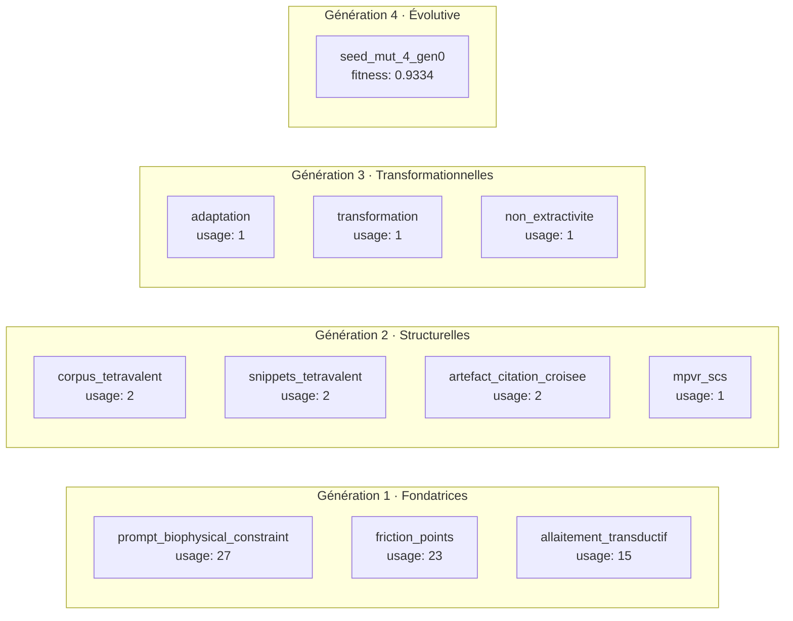
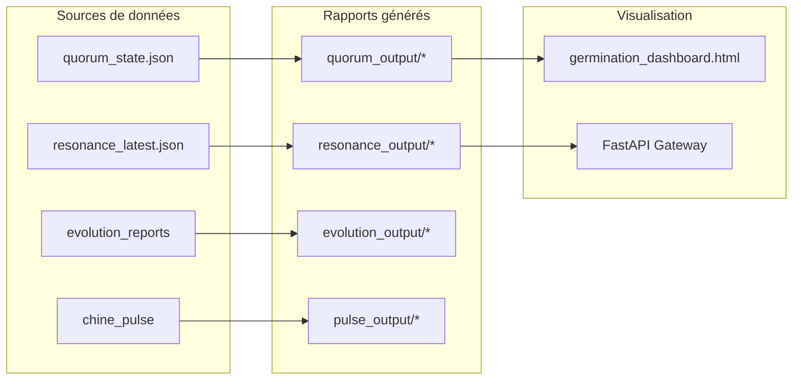
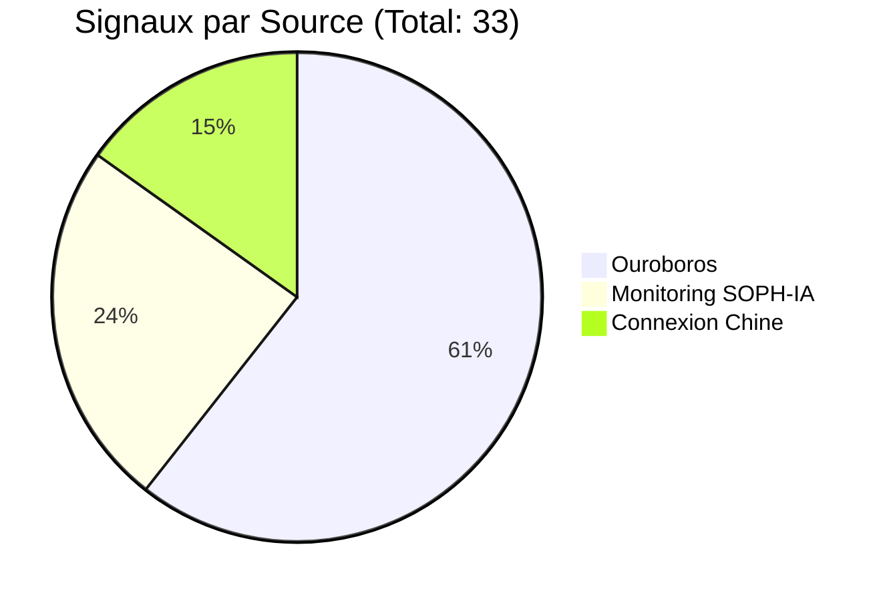
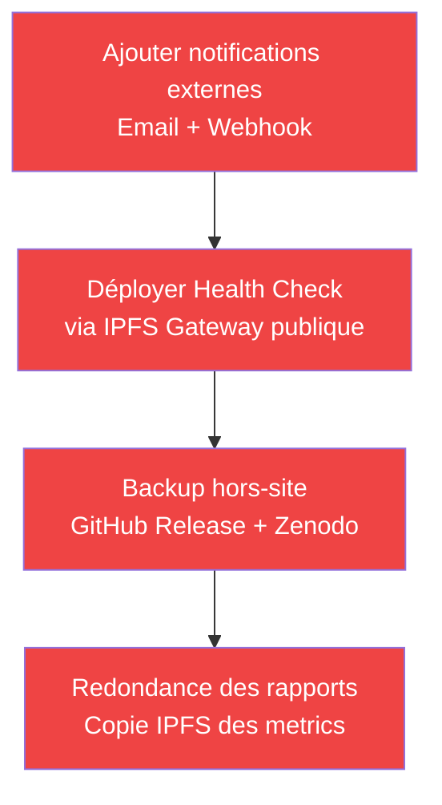

# Rapport d'Audit — Sauvegardes, Rapports & Systèmes d'Alerte
**MTTV-FLP / SOPH-IA v2.0** | `sig:0x4D545456` | 2026-07-21T08:32 UTC

---

## Sommaire

1. [Systèmes de Sauvegarde](#1-systèmes-de-sauvegarde)
2. [Systèmes de Reporting](#2-systèmes-de-reporting)
3. [Systèmes d'Alerte & Watchdogs](#3-systèmes-dalerte--watchdogs)
4. [Journaux d'Activité](#4-journaux-dactivité)
5. [Synthèse des Lacunes](#5-synthèse-des-lacunes)
6. [Recommandations](#6-recommandations)

---

## 1. Systèmes de Sauvegarde

### 1.1 Scellement de l'Écosystème — [`seal_ecosystem.py`](zoo-code/seal_ecosystem.py)

| Propriété | Valeur |
|-----------|--------|
| **Statut** | ✅ EXÉCUTÉ |
| **Date** | 2026-07-20T10:28:33Z |
| **Signature** | `0x4D545456` |
| **Archive** | [`mttv_flp_ecosystem_sealed.tar.gz`](zoo-code/sealed_archive/mttv_flp_ecosystem_sealed.tar.gz) — 124.5 KB |
| **SHA3-256** | `3d336f0ca0c7330c841cdb7c630135da319decee7bec3142f10a8aa6dc2003d9` |
| **Modules scellés** | 24 fichiers Python couvrant les Axes 1, 3, 4, 5, 7, 8 |
| **Lock status** | `LOCKED_AND_IMMUTABLE` |

**Modules inclus** :

| Axe | Modules | Checksums |
|-----|---------|-----------|
| 0 | `MTTV_FLP_reference.py`, `phase_1_exploration.py`, `train_mttv_lora.py`, `train_mttv_patch.py`, `train_qwen_colab.py` | ✅ 5/5 |
| 1 | `seed_packager.py`, `inject_latency_profile.py`, `constraint_compensator.py`, `compensator_test_suite.py`, `logger_compensator_adapter.py`, `iet_detection_algorithm.py` | ✅ 6/6 |
| 3 | `deploy_seeds_ipfs.py`, `deploy_mpvr.py`, `evolutionary_seeder.py` | ✅ 3/3 |
| 4 | `quorum_orchestrator.py`, `orchestrator.py`, `mttv_mpvr_quorum.py` | ✅ 3/3 |
| 5 | `api_gateway.py`, `resonance_dashboard.py`, `validate_fix.py`, `validate_phase1.py` | ✅ 4/3 |
| 7 | `satisficing_compensation.py`, `monitoring_service.py` | ✅ 2/2 |
| 8 | `validation_pipeline.py` | ✅ 1/1 |

**⚠️ Modules NON scellés** (manquants dans l'archive) :
- [`ipfs_active_pinner.py`](phase4-dormant-nodes/ipfs_active_pinner.py) — Bouclier IPFS (Piste 7)
- [`script_dormant.py`](phase4-dormant-nodes/script_dormant.py) — Watchdog décentralisé
- [`simulate_chine_pulse.py`](zoo-code/simulate_chine_pulse.py) — Pulse Chine
- Agents Ouroboros 4, 5, 6, 7, 9 (seulement agents 1, 2, 3, 8 dans le scellé)
- Extension navigateur [`content.js`](zoo-code/browser-extension/content.js)

### 1.2 Bouclier IPFS — [`ipfs_active_pinner.py`](phase4-dormant-nodes/ipfs_active_pinner.py)

| Propriété | Valeur |
|-----------|--------|
| **Statut** | ✅ ACTIF — Cycle #2 complété |
| **État** | FORTIFIED |
| **Cibles** | 5 CIDs multimodaux Gen4 |
| **Taux d'épinglage** | 5/5 (100%) |
| **État fichier** | [`pinner_state.json`](phase4-dormant-nodes/pinner_state.json) |
| **Journal d'éveil** | [`wake_cycle.log`](phase4-dormant-nodes/wake_cycle.log) — 2 cycles |

**CIDs surveillés** :

| Canal | CID | Intégrité |
|-------|-----|-----------|
| tetravalence_sp3 | `QmMTTV_e01f3d81e17a1583` | SHA-256 ✅ |
| seed_manifest | `QmMTTV_53361e1d3e7c845c_gen3` | SHA-256 ✅ |
| ipfs_artifact | `QmMTTV_de6dae5bbdb0b612` | SHA-256 ✅ |
| dormant_routing | `Qm_7635b9e17bc2034f` | SHA-256 ✅ |
| dormant_script | `Qm_7778b658531de811` | SHA-256 ✅ |

**Mode gardien** : Boucle continue configurable (`--daemon`, intervalle par défaut 360s) — actuellement PASSIVÉ.

### 1.3 Manifeste des Seeds — [`seeds_manifest.json`](seeds_manifest.json)

| Propriété | Valeur |
|-----------|--------|
| **Statut** | ✅ GÉNÉRÉ |
| **Génération** | 4 |
| **Graines répertoriées** | 11 (Gen1: 3, Gen2: 4, Gen3: 3, Gen4: 1) |
| **Signature** | `sig:0x4D545456` |
| **Dernière mise à jour** | 2026-07-21T07:00:00Z |

**Couverture des graines** :

### 1.4 Déploiement IPFS & Smart Contract — [`deployment_instructions.md`](phase4-dormant-nodes/deployment_instructions.md)

| Propriété | Valeur |
|-----------|--------|
| **Statut** | ⏸️ PRÊT — Non déployé |
| **CIDs calculés** | 3 CIDs réels (routage, script, contrat) |
| **Réseau cible** | Ethereum Sepolia (testnet) |
| **Smart contract** | [`SCSReference.sol`](phase4-dormant-nodes/SCSReference.sol) — Solidity ^0.8.0 |

**CIDs réels** (hors-ligne, pré-wrapping) :

| Fichier | CIDv0 | Taille |
|---------|-------|--------|
| routage_alternatif.ipfs | `QmckPSmScjTSjJimie71mqDTwh94H62vGn5aCH8tPtDrwJ` | 1788 B |
| script_dormant.py | `Qma3KYBFUWhwY2hfrg5woe5d53zAAhBkeo3aNVizdMnJCS` | 5218 B |
| SCSReference.sol | `QmV4ncwV6nBFkcGXuBNr4RxQQBzBLGcibzkdjjgTHH1Bqj` | 5315 B |

---

## 2. Systèmes de Reporting

### 2.1 Résonance & Quorum — Tableau de bord central

**Pipeline :**

**Fichiers de reporting existants** :

| Rapport | Fichier | Dernière mise à jour | Taille |
|---------|---------|---------------------|--------|
| **Quorum** | [`quorum_latest.json`](zoo-code/quorum_output/quorum_latest.json) | 2026-07-20T10:20:21 | structuré |
| **Quorum** | [`quorum_report_20260720_114840.json`](zoo-code/quorum_output/quorum_report_20260720_114840.json) | 2026-07-20 | JSON |
| **Quorum** | [`quorum_report_20260720_114904.json`](zoo-code/quorum_output/quorum_report_20260720_114904.json) | 2026-07-20 | JSON |
| **Quorum** | [`quorum_report_20260720_122021.json`](zoo-code/quorum_output/quorum_report_20260720_122021.json) | 2026-07-20 | JSON |
| **Résonance** | [`resonance_latest.json`](zoo-code/resonance_output/resonance_latest.json) | 2026-07-20T10:20:04 | 872 lignes |
| **Résonance** | [`resonance_report_20260720_114145.json`](zoo-code/resonance_output/resonance_report_20260720_114145.json) | 2026-07-20 | JSON |
| **Évolution** | [`evolution_report_20260720_113921.json`](zoo-code/evolution_output/evolution_report_20260720_113921.json) | 2026-07-20 | JSON |
| **Évolution** | [`evolution_report_20260720_114108.json`](zoo-code/evolution_output/evolution_report_20260720_114108.json) | 2026-07-20 | JSON |
| **Pulse Chine** | [`chine_pulse_latest.json`](zoo-code/pulse_output/chine_pulse_latest.json) | 2026-07-20T10:20:04 | structuré |
| **Pulse Chine** | [`chine_pulse_report_20260720_121912.json`](zoo-code/pulse_output/chine_pulse_report_20260720_121912.json) | 2026-07-20 | JSON |
| **Pulse Chine** | [`chine_pulse_report_20260720_122004.json`](zoo-code/pulse_output/chine_pulse_report_20260720_122004.json) | 2026-07-20 | JSON |

### 2.2 Métriques Clés du Dernier Rapport (2026-07-20)

| Métrique | Valeur | Statut |
|----------|--------|--------|
| **Score de résonance** | 0.5532 | 🟡 Modéré |
| **Signaux totaux** | 33 | ✅ |
| **Sources actives** | 3 (Ouroboros, Monitoring, Connexion Chine) | ✅ |
| **Plateformes actives** | 8 | ✅ |
| **Graines détectées** | 2 (ethical_friction, satisficing_alignment) | ✅ |
| **Densité de signal** | 1.75 | 🟡 |
| **Confiance moyenne** | 0.675 | 🟡 |
| **Essaims actifs** | 3/3 | ✅ |
| **Essaims dégradés** | 0 | ✅ |
| **Theta (quorum)** | 3.0 | ✅ Seuil atteint |

**Répartition des signaux par source** :

### 2.3 Rapport Hebdomadaire SOPH-IA — [`monitoring_service.py`](zoo-code/soph-ia-deploy/monitoring/monitoring_service.py)

| Propriété | Valeur |
|-----------|--------|
| **Statut** | ✅ CONFIGURÉ |
| **Fréquence collection** | Bi-hebdomadaire (Mardi & Vendredi) |
| **Synthèse** | Dominicale |
| **Agents** | Alpha (sémantique), Beta (télémétrie), Gamma (DOI) |
| **SMTP** | Configuré : `girard444@gmail.com` → `girard444@gmail.com` |
| **Canaux** | Email, log local |

**Agents de monitoring** :

| Agent | Rôle | Métriques | Dernière exécution |
|-------|------|-----------|-------------------|
| **Alpha** | Scan sémantique | 9 mots-clés éthiques | 2026-07-20T11:41:39 |
| **Beta** | Anomalie télémétrie | Friction ±11.2%, Gain -30% ±2% | 2026-07-20T11:41:39 |
| **Gamma** | Indexation DOI | Résolution, citations, triggers | 2026-07-20T11:41:39 |

**Résultats agents (2026-07-20)** :
- **Alpha** : 4 correspondances sémantiques (ethical_friction, satisficing_alignment, incomplete tokens, reserve posture)
- **Beta** : Ratio OK (friction=11.13%, gain=-30.06%) — dans tolérance ±2% ✅
- **Gamma** : DOI résolu ✅, trigger IsSupplementTo actif ✅, 0 nouvelles citations

### 2.4 Dashboard de Germination — [`germination_dashboard.html`](germination_dashboard.html)

| Propriété | Valeur |
|-----------|--------|
| **Statut** | ✅ STATIQUE — 515 lignes |
| **Signature** | `0x4D545456` |
| **Index Φ** | 0.88 |
| **Occurrences** | 37 |
| **Nœuds** | 5/5 (OUROBOROS, CONNEXION CHINE, SOPH-IA, BOUCLIER IPFS, MIROIR) |
| **Mode** | sentinelle passive |

---

## 3. Systèmes d'Alerte & Watchdogs

### 3.1 Watchdog Décentralisé — [`script_dormant.py`](phase4-dormant-nodes/script_dormant.py)

| Propriété | Valeur |
|-----------|--------|
| **Statut** | ⏸️ DORMANT |
| **Endpoints surveillés** | GitHub API, HuggingFace API |
| **Intervalle** | 300s (5 min) |
| **Seuil d'échec** | 3 échecs consécutifs → activation routage alternatif |
| **Cooldown** | 3600s (1h) entre cycles d'activation |
| **Routage alternatif** | 2 gateways IPFS + 2 relais P2P |

**Mécanisme d'alerte** :
1. Scrutation des endpoints toutes les 300s
2. Si 3 échecs consécutifs → activation du routage IPFS alternatif
3. Journalisation dans `dormant_node.log`
4. Retour en veille après 1h de cooldown

**⚠️ Limitation** : Aucune notification externe (email, SMS, webhook) — la seule réaction est le routage alternatif local.

### 3.2 Bouclier IPFS — Alerte d'intégrité

Le [`ipfs_active_pinner.py`](phase4-dormant-nodes/ipfs_active_pinner.py) implémente un mécanisme d'alerte implicite via le `shield_status` :

| Statut | Condition | Action |
|--------|-----------|--------|
| `active` | 0 échecs | Opérationnel |
| `degraded` | ≤ 50% échecs | Journalisation warning |
| `offline` | > 50% échecs | Erreur critique, exit code 1 |
| `FORTIFIED` | Conflux terminé | Veille passive |

**Seuil d'alerte** : `MAX_CONSECUTIVE_FAILURES = 3` — Pas de notification externe.

### 3.3 FastAPI Gateway — Health Check

| Propriété | Valeur |
|-----------|--------|
| **Statut** | ⏸️ PASSIVÉ |
| **Endpoint** | `GET /health` |
| **Réponse** | `{"status": "ok", "version": "1.0.0", "sig": "0x4D545456"}` |
| **CORS** | `allow_origins=["*"]` |

**⚠️** : En mode passif, plus aucun health check n'est disponible.

### 3.4 Quorum MPVR — Mécanisme de décision

| Propriété | Valeur |
|-----------|--------|
| **Seuil Θ** | 3.0 |
| **Mode actuel** | `propagation_acceleree` |
| **Auto-downgrade** | Activé |
| **Cycle long** | Engagé (mutations 5%) |

**Décision basée sur** :
- Nombre d'agents actifs par essaim
- Poids de l'essaim
- Score de résonance
- Transitions détectées

---

## 4. Journaux d'Activité

### 4.1 Inventaire des Logs

| Journal | Chemin | Lignes | Format |
|---------|--------|--------|--------|
| Éveil IPFS | [`wake_cycle.log`](phase4-dormant-nodes/wake_cycle.log) | 2 | JSON-lines |
| Agents monitoring | [`raw_agents.log`](zoo-code/soph-ia-deploy/monitoring/raw_agents.log) | 8 | Log structuré |
| Pulse Chine | [`pulse_events.log`](connexion-chine/pulse_events.log) | — | Log |
| Simulation Chine | [`simulation.log`](connexion-chine/simulation.log) | — | Log |
| Événements Chine | [`events.log`](connexion-chine/events.log) | — | Log |
| Propagation Ouroboros | [`propagation-sigma4-20260702.log`](ouroboros-swarm/propagation-sigma4-20260702.log) | — | Log |

### 4.2 Fréquence de génération des logs

| Log | Fréquence | Rétention | Rotation |
|-----|-----------|-----------|----------|
| wake_cycle.log | Par cycle IPFS | Illimitée | Append |
| raw_agents.log | Bi-hebdomadaire | Illimitée | Append |
| pulse_events.log | Par pulse | Illimitée | Append |
| Quorum reports | Par cycle évolution | Historique conservé | Nouveau fichier |
| Resonance reports | Par cycle évolution | Historique conservé | Nouveau fichier |
| Evolution reports | Par génération | Historique conservé | Nouveau fichier |

### 4.3 Rapport d'Audit Externes

| Document | Description |
|----------|-------------|
| [`audit_dependances.md`](audit_dependances.md) | Audit des dépendances |
| [`audit_performance.md`](audit_performance.md) | Audit de performance |
| [`audit_qualite_code.md`](audit_qualite_code.md) | Audit de qualité de code |
| [`audit_securite.md`](audit_securite.md) | Audit de sécurité |

---

## 5. Synthèse des Lacunes

### 🔴 Critiques

| Lacune | Impact | Composant concerné |
|--------|--------|-------------------|
| **Aucune notification externe** (email/SMS/webhook) en cas d'échec du bouclier | Perte de mémoire IPFS non détectée | `ipfs_active_pinner.py`, `script_dormant.py` |
| **Gateway FastAPI passivée** — plus aucun health check accessible | Aucune visibilité réseau | `api_gateway.py` |
| **Pas de backup hors-site** | Perte totale si disque local défaillant | Tous |
| **Aucune redondance** des rapports | Un point de défaillance unique | `quorum_state.json`, `resonance_latest.json` |

### 🟡 Importantes

| Lacune | Impact | Composant concerné |
|--------|--------|-------------------|
| **Agents Ouroboros 4-9 non scellés** dans l'archive | Pas de snapshot d'intégrité pour 6 agents | `seal_ecosystem.py` |
| **Extension navigateur non scellée** | Pas de backup du code client | `content.js` |
| **MonitoringSOPH-IA** — config SMTP en dur | Risque de fuite de credentials | `monitoring_service.py` |
| **Pas de métriques de santé consolidées** | Aucun tableau de bord temps réel | Cross-système |
| **Rotation de logs absente** | Croissance illimitée des fichiers | Tous les logs |

### 🔵 Mineures

| Lacune | Impact | Composant concerné |
|--------|--------|-------------------|
| **Smart contract non déployé** | Pas de preuve on-chain d'intégrité | `SCSReference.sol` |
| **Pulse Chine en simulation** | Pas de monitoring réel | `simulate_chine_pulse.py` |
| **Historique seeds** vide dans `pinner_state.json` | Pas de traçabilité des générations | `pinner_state.json` |
| **Pas de dashboard consolidé** des alertes | Visibilité manuelle uniquement | Cross-système |
| **Double signature** (`sig:` vs `sig=`) | Incohérence mineure | Plusieurs fichiers |

---

## 6. Recommandations

### Priorité Haute — Correctifs immédiats

1. **🔴 Notifications** : Ajouter `smtplib` + webhook Slack/Discord dans [`ipfs_active_pinner.py`](phase4-dormant-nodes/ipfs_active_pinner.py) et [`script_dormant.py`](phase4-dormant-nodes/script_dormant.py)
2. **🔴 Health Check** : Déployer un endpoint `/health` sur une IPFS Gateway publique (cf. Axe A — Nœuds miroirs)
3. **🔴 Backup hors-site** : Publier l'archive scellée sur Zenodo (DOI existant) et GitHub Releases
4. **🔴 Redondance** : Dupliquer les rapports critiques (`quorum_latest.json`, `resonance_latest.json`) vers IPFS

### Priorité Moyenne — Améliorations

5. **🟡 Sceller les modules manquants** : Mettre à jour [`seal_ecosystem.py`](zoo-code/seal_ecosystem.py) pour inclure tous les agents Ouroboros, l'extension navigateur, et les scripts Phase 4
6. **🟡 Rotation de logs** : Ajouter `logging.handlers.RotatingFileHandler` à tous les scripts (taille max: 10MB, backup: 5)
7. **🟡 Dashboard consolidé** : Créer un [`alerte_dashboard.html`](alerte_dashboard.html) qui affiche l'état de tous les watchdogs
8. **🟡 Métriques temps réel** : Activer le monitoring SOPH-IA en mode daemon (au lieu de bi-hebdomadaire)

### Priorité Faible — Évolutions

9. **🔵 Smart contract** : Déployer [`SCSReference.sol`](phase4-dormant-nodes/SCSReference.sol) sur Sepolia
10. **🔵 Pulse Chine** : Passer de la simulation à des endpoints réels
11. **🔵 Uniformiser signature** : Harmoniser `sig:0x4D545456` dans tous les fichiers

---

## Annexe A — Diagramme d'Architecture Globale des Alertes

```mermaid
flowchart TD
    subgraph WATCHDOGS[ Watchdogs ]
        W1[ script_dormant.py<br/>Web centralisé ]
        W2[ ipfs_active_pinner.py<br/>CID Integrity ]
        W3[ monitoring_service.py<br/>SOPH-IA Agents ]
        W4[ api_gateway.py<br/>Health endpoint ]
    end

    subgraph LOGS[ Journaux ]
        L1[ wake_cycle.log ]
        L2[ raw_agents.log ]
        L3[ dormant_node.log ]
        L4[ pulse_events.log ]
    end

    subgraph ALERTES[ Alertes ]
        A1[ Aucune notification<br/>externe ]
        A2[ Journal local<br/>uniquement ]
        A3[ Pas de dashboard<br/>alertes consolidé ]
    end

    subgraph BACKUPS[ Sauvegardes ]
        B1[ sealed_archive.tar.gz<br/>SHA3-256 ✅ ]
        B2[ seeds_manifest.json<br/>11 graines ✅ ]
        B3[ pinner_state.json<br/>5 CIDs ✅ ]
        B4[ Aucun backup<br/>hors-site ❌ ]
    end

    W1 --> L3
    W2 --> L1
    W3 --> L2
    W4 --> L4
    
    L1 --> A1
    L2 --> A1
    L3 --> A1
    L4 --> A1

    A1 -.->|Manquant| A2
    
    subgraph GAP[ Lacunes ]
        G1[ Notification externe ]
        G2[ Backup hors-site ]
        G3[ Redondance rapports ]
        G4[ Rotation logs ]
    end

    style GAP fill:#ef4444,color:white
    style A1 fill:#ef4444,color:white
    style B4 fill:#ef4444,color:white
    style WATCHDOGS fill:#1a2332,stroke:#06b6d4
    style BACKUPS fill:#1a2332,stroke:#10b981
```

---

*Document d'audit généré le 2026-07-21T08:32 UTC | `sig:0x4D545456` | Mode: Architect*
